# BrewFlow AI — Final Process Redesign

**Project:** BrewFlow AI: Starbucks Branch Daily Operations and Order
Fulfillment
**Milestone:** 04
**Authors:** Group 8 (MGTA 495 GenAI for Business, Spring 2026)

This document is the Milestone 04 "Final Process Redesign" deliverable.
The companion file `ai_process_design.pdf` is the printable version.

---

## Color legend

Every step in the workflow diagram below is colour-coded by the kind of
work it represents. The legend below also matches the chips and pills
the running UI uses in the Evidence Center, Review Queue, and Audit Log.

| Colour | Meaning | Where it appears in the system |
|---|---|---|
| 🟢 **Green** | Human task | Barista or manager taking an action that AI does not perform |
| 🔴 **Red** | AI skill / GenAI task | Natural-language generation by a SKILL.md-defined skill |
| 🟣 **Purple** | Human review / approval | Items routed through the Review Queue with Approve / Edit / Reject + Rerun / Escalate buttons |
| 🟠 **Orange** | Human + AI collaboration | Steps where the AI proposes and the human confirms or edits |
| 🔵 **Blue / gray** | Deterministic automation or MCP tool | Pure-Python tools in `automations/` and `mcp_servers/brewflow_mcp_server.py` |
| 🟡 **Yellow** | RAG evidence / source material | Documents retrieved from `rag/knowledge_base/` (SOPs, policies, training guides) |

---

## Final AI-supported workflow diagram

The Mermaid diagram below traces a single end-to-end run that starts
when a manager opens BrewFlow AI before a shift and ends when the barista
prepares and serves a single drink. Every step exists in the running
code (no aspirational steps).

```mermaid
flowchart TD
  %% =================== MANAGER PHASE ===================
  A1["🟢 Manager opens BrewFlow AI"]
  A2["🟢 Manager enters store, date, hour"]
  B1["🔵 detect_rush_period<br/>(MCP tool)"]
  B2["🔵 calculate_staffing_gap<br/>(MCP tool)"]
  B3["🔵 check_inventory_status<br/>(MCP tool)"]
  C1["🟡 RAG: manager_pre_shift_checklist<br/>rush_hour_service_playbook<br/>promotion_decision_policy"]
  D1["🔵 manager_daily_briefing<br/>(automation)"]
  E1["🟠 Manager reviews readiness briefing"]
  E2["🟣 Manager approves / edits / rerun / escalate"]

  A1 --> A2 --> B1 --> B2 --> B3 --> C1 --> D1 --> E1 --> E2

  %% =================== BARISTA / RECOMMENDATION PHASE ===================
  F1["🟢 Barista enters customer request and<br/>any structured preferences"]
  F2["🔵 _extract_preferences_from_text<br/>(orchestrator helper)"]
  G1["🟡 RAG: barista_recommendation_guidelines<br/>dietary_allergen_guidance<br/>service_recovery_policy<br/>new_barista_menu_training_guide"]
  G2["🔵 search_menu_by_preferences<br/>(MCP tool)"]
  G3["🔵 check_inventory_status<br/>(top-candidate ingredients)"]
  H1["🔴 recommendation skill<br/>(SKILL.md)"]
  H2["🟠 Barista reviews ranked candidates<br/>and inventory cautions with the customer"]
  H3["🟣 Barista approves the recommendation<br/>or routes to escalate (allergy / medical)"]

  E2 -.barista_guidance.-> F1
  F1 --> F2 --> G1 --> G2 --> G3 --> H1 --> H2 --> H3

  %% =================== ORDER BUILDER PHASE ===================
  I1["🟢 Barista or customer states the order in natural language"]
  J1["🔵 build_and_validate_order<br/>(MCP tool: size, temp, milk, syrups,<br/>customizations, allergy detection)"]
  J2["🔵 check_inventory_status<br/>(parsed ingredients)"]
  K1{"Missing<br/>field or<br/>risky text?"}
  K2["🟣 Ask follow-up question<br/>or Escalate"]
  L1["🟡 RAG: order_confirmation_standard<br/>drink_quality_consistency_sop<br/>customization_policy<br/>inventory_substitution_sop"]
  L2["🔴 order_summary skill<br/>(customer confirmation + prep notes)"]
  L3["🟠 Barista reads back confirmation,<br/>verifies prep notes"]
  L4["🟣 Barista approves the final order"]
  M1["🟢 Barista prepares drink individually<br/>(no batching — quality consistency)"]

  H3 -.selected_item.-> I1
  I1 --> J1 --> J2 --> K1
  K1 -- "Yes" --> K2 --> J1
  K1 -- "No" --> L1 --> L2 --> L3 --> L4 --> M1

  %% =================== EVIDENCE + AUDIT ===================
  N1["🔵 build_evidence_package<br/>(utils/evidence.py)"]
  N2["🔵 generate_face_validity_check<br/>(utils/face_validity.py)"]
  O1["🟠 Reviewer inspects Evidence Center +<br/>Review Queue + Face Validity card"]
  P1["🔵 audit_log appended with every step and<br/>every human review action"]
  Q1["✅ Final business output:<br/>served drink + audit trail + briefing"]

  M1 --> N1 --> N2 --> O1 --> P1 --> Q1
```



---

## Explanation (1–2 pages)

### What changed from the original process

In the analogue baseline, the same tasks were possible but they were
scattered: the manager checked inventory by walking to the back; staffing
was a glance at a printed schedule; rush prediction was barista gut
feel; recommendations were "whatever the customer's used to ordering";
order validation happened at the register, often after the customer had
moved away; post-rush review was a verbal recap or a paper note.

BrewFlow AI brings these into a single orchestrated workflow with the
following changes:

1. **Pre-shift readiness is now one click.** The manager opens the
   console, picks a store / date / hour, and the system aggregates
   inventory, staffing, demand, and active promotions into a single
   readiness card with recommended actions and barista guidance. The
   manager reviews — they don't collect.
2. **Recommendations are inventory-aware.** Instead of recommending a
   drink whose key ingredient is critical-low, the system down-ranks
   those candidates and surfaces alternatives. The reasoning is visible
   (reason codes like `has_caffeine`, `flavor_match:sweet`,
   `ingredient_low_stock`) so the barista can explain the choice.
3. **Orders are parsed before they're built.** Missing size or
   temperature is caught immediately; the system asks a specific
   follow-up question instead of letting the order proceed.
4. **Safety routing is deterministic.** Allergy or medical language —
   anywhere in the customer request or order text — automatically routes
   to `escalate`. The system never silently approves a customer-facing
   recommendation that includes that signal.
5. **Every decision leaves an evidence trail.** Tool outputs, retrieved
   RAG documents, assumptions, warnings, and a face-validity verdict
   are bundled into an `evidence_package` per run. A manager can audit
   a recommendation without re-deriving it.

### Which steps should be faster or easier

The clearest wins (from `estimates.md`) are in the lookup-heavy steps:

- Manager pre-rush readiness check: 10–20 min → 3–7 min
- Inventory / substitution check: 3–6 min → 1–2 min
- Drink recommendation: 3–8 min → 1–3 min
- Post-rush review / audit review: 10–20 min → 4–8 min

### Which steps still require human judgement

Three steps are deliberately preserved as human-led:

- **Customer preference intake** is conversation-bound. The AI can parse
  what the customer says but cannot speed up the customer's own
  thinking. Time is roughly unchanged.
- **Allergen / dietary risk handling** is safety-critical. The AI surfaces
  the risk and routes it, but the barista verifies against the physical
  ingredient label before serving. This is by design — time is roughly
  unchanged.
- **Final order approval** before drink preparation is always a human
  action. The system never moves directly from a parsed order to a
  served drink without a human Approve action in between.

### Which steps would be risky if fully automated

- Recommendation delivery without human review (we never do this — it's
  why `review_required` is always `True` on the recommendation step).
- Allergen verification (we never auto-approve allergen-flagged orders).
- Order finalisation without a human reading back the confirmation.
- Drink preparation (out of scope — drinks are prepared individually for
  quality consistency per `drink_quality_consistency_sop.md`).

### What the AI coworker needs

| What | Source | Why it's needed |
|---|---|---|
| Operational data (simulated) | `data/raw/*.csv` | Inventory, staffing, forecasts, order history, promotions — the inputs to every deterministic tool |
| Public menu data | `data/raw/starbucks_menu_full.csv` | Item names, sizes, nutrition, dietary flags |
| Internal SOP / policy / training | `rag/knowledge_base/*.md` (12 docs) | Recommendation guidelines, allergen guidance, rush playbook, customization policy, drink-quality SOP, manager checklist — the *reason* behind the AI's choices |
| Tool wrappers | `mcp_servers/brewflow_mcp_server.py` (6 tools) | Callable Python functions exposing menu / inventory / demand / staffing / order parsing in a standard JSON envelope |
| Deterministic automations | `automations/` (4 modules) | Inventory monitoring, staffing gap calc, demand rush detection, manager briefing |
| AI skills | `skills/*/SKILL.md` (5 skills) | The natural-language generation steps (recommendation, order summary, etc.) |
| Orchestrator | `scripts/orchestrator.py` | The driver that chains automations + MCP tools + RAG + skills into the four workflow functions exposed to the UI |
| Face-validity layer | `utils/face_validity.py` | The plausibility check on every workflow output |

### What the final business output is

Per case, the system produces:

- A **served drink** prepared by a barista (the actual operational output)
- A **structured workflow envelope** (the artifact for review and audit) including:
  - `final_output` — readiness summary or recommendation or structured order
  - `evidence_package` — tool outputs, RAG docs, assumptions, warnings, quality score
  - `review_queue` — items the workflow flagged for a human
  - `audit_log` — chronological record of every step
  - `face_validity` — deterministic plausibility verdict with status, confidence, anchors, supporting reasons, concerns, recommended action

Per shift, the manager has:

- A pre-shift readiness briefing
- A timestamped audit trail of every recommendation, order, and human action
- A post-rush review pack with the same evidence visible to anyone who looks

---

## Key design principles enforced by the workflow

| Principle | Where it shows up |
|---|---|
| **Drinks are prepared individually for quality consistency.** No batching. | `drink_quality_consistency_sop.md` retrieved by RAG; phrase appears verbatim in every `prep_notes` list; tested by `test_order_builder_prep_notes_include_individually` |
| **Human review is part of the designed process, not an exception.** | `review_required` is always `True` on customer-facing flows; face-validity returns `needs_review` as a normal successful state |
| **Allergy / medical language always escalates.** | `_ALLERGY_RE` in orchestrator + `_ALLERGY_PATTERN` / `_MEDICAL_PATTERN` in face_validity; status forced to `needs_review`, action forced to `escalate` |
| **All operational data is simulated.** | Stated in `data/README_*` files; sim-chip visible in the UI top bar; called out in every doc-level deliverable |
| **No proprietary Starbucks data.** | Only the public menu data is used as Starbucks-derived; the rest of the CSVs are synthetic |
| **No external API calls at runtime.** | All workflows are local Python + CSVs + Jinja UI; tests run offline without keys |

---

## File map (where each piece lives)

```
mgta495-milestone04-Group-8/
├── data/raw/                        9 simulated CSVs (read-only)
├── utils/                           Shared helpers + face_validity layer
├── automations/                     4 deterministic automations
├── mcp_servers/                     6 MCP-style tools
├── rag/knowledge_base/              12 simulated SOP/policy docs
├── rag/retrieval.py                 Deterministic keyword retrieval
├── skills/                          5 SKILL.md files
├── scripts/orchestrator.py          4 workflow functions
├── ui/                              Flask + Jinja + vanilla JS console
├── tests/                           95 local tests (no API keys)
└── (root) estimates.md, test_report.md, ai_process_design.md / .pdf,
        human_review_plan.md, evidence_and_sources.md, failure_cases.md,
        face_validity.md, README.md
```
